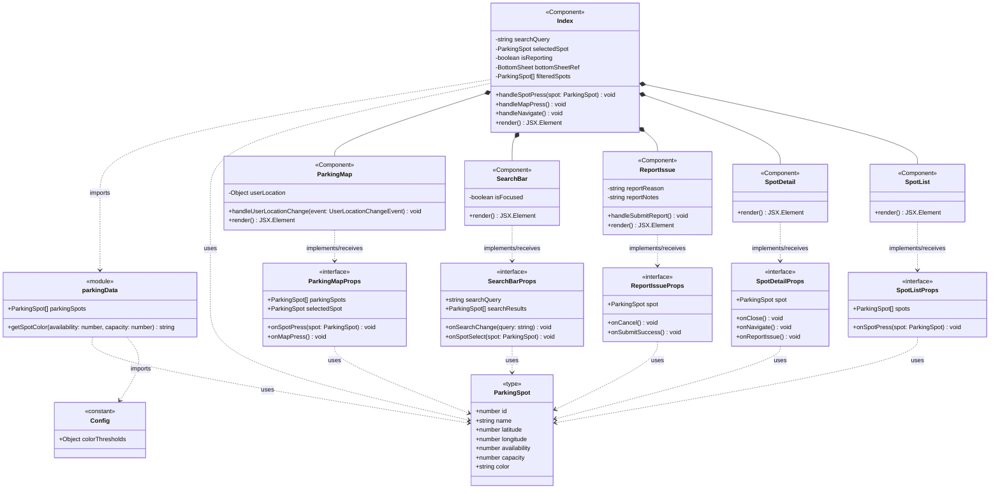

# KU Parking Mobile App - Class Diagram

```mermaid
classDiagram
    %% Data & Config
    class Config {
        <<constant>>
        +Object colorThresholds
    }

    class ParkingSpot {
        <<type>>
        +number id
        +string name
        +number latitude
        +number longitude
        +number availability
        +number capacity
        +string color
    }

    class parkingData {
        <<module>>
        +ParkingSpot[] parkingSpots
        +getSpotColor(availability: number, capacity: number) string
    }

    %% Main App Component
    class Index {
        <<Component>>
        -string searchQuery
        -ParkingSpot selectedSpot
        -boolean isReporting
        -BottomSheet bottomSheetRef
        -ParkingSpot[] filteredSpots
        +handleSpotPress(spot: ParkingSpot) void
        +handleMapPress() void
        +handleNavigate() void
        +render() JSX.Element
    }

    %% Child Components and their Props
    class ParkingMap {
        <<Component>>
        -Object userLocation
        +handleUserLocationChange(event: UserLocationChangeEvent) void
        +render() JSX.Element
    }
    class ParkingMapProps {
        <<interface>>
        +ParkingSpot[] parkingSpots
        +ParkingSpot selectedSpot
        +onSpotPress(spot: ParkingSpot) void
        +onMapPress() void
    }

    class SearchBar {
        <<Component>>
        -boolean isFocused
        +render() JSX.Element
    }
    class SearchBarProps {
        <<interface>>
        +string searchQuery
        +onSearchChange(query: string) void
        +ParkingSpot[] searchResults
        +onSpotSelect(spot: ParkingSpot) void
    }

    class ReportIssue {
        <<Component>>
        -string reportReason
        -string reportNotes
        +handleSubmitReport() void
        +render() JSX.Element
    }
    class ReportIssueProps {
        <<interface>>
        +ParkingSpot spot
        +onCancel() void
        +onSubmitSuccess() void
    }

    class SpotDetail {
        <<Component>>
        +render() JSX.Element
    }
    class SpotDetailProps {
        <<interface>>
        +ParkingSpot spot
        +onClose() void
        +onNavigate() void
        +onReportIssue() void
    }

    class SpotList {
        <<Component>>
        +render() JSX.Element
    }
    class SpotListProps {
        <<interface>>
        +ParkingSpot[] spots
        +onSpotPress(spot: ParkingSpot) void
    }

    %% Relationships Definition
    
    %% Config & Data relations
    parkingData ..> ParkingSpot : uses
    parkingData ..> Config : imports

    %% Main Component Imports & Usage
    Index ..> parkingData : imports
    Index ..> ParkingSpot : uses

    %% Composition (Index renders these child components)
    Index *-- ParkingMap
    Index *-- SearchBar
    Index *-- ReportIssue
    Index *-- SpotDetail
    Index *-- SpotList

    %% Props mapping
    ParkingMap ..> ParkingMapProps : implements/receives
    SearchBar ..> SearchBarProps : implements/receives
    ReportIssue ..> ReportIssueProps : implements/receives
    SpotDetail ..> SpotDetailProps : implements/receives
    SpotList ..> SpotListProps : implements/receives

    %% Props depend on ParkingSpot
    ParkingMapProps ..> ParkingSpot : uses
    SearchBarProps ..> ParkingSpot : uses
    ReportIssueProps ..> ParkingSpot : uses
    SpotDetailProps ..> ParkingSpot : uses
    SpotListProps ..> ParkingSpot : uses
```
