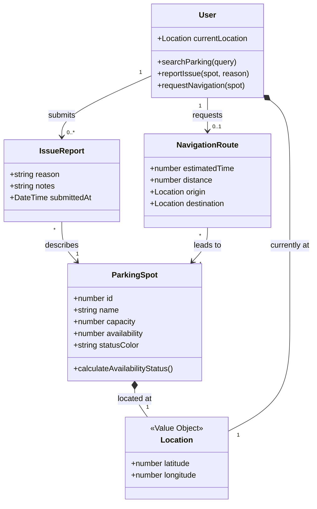

# KU Parking Mobile App - Domain Model Diagram

```mermaid
classDiagram
    %% Core Entities
    class User {
        +Location currentLocation
        +searchParking(query)
        +reportIssue(spot, reason)
        +requestNavigation(spot)
    }

    class ParkingSpot {
        +number id
        +string name
        +number capacity
        +number availability
        +string statusColor
        +calculateAvailabilityStatus()
    }

    class Location {
        <<Value Object>>
        +number latitude
        +number longitude
    }

    class IssueReport {
        +string reason
        +string notes
        +DateTime submittedAt
    }

    class NavigationRoute {
        +number estimatedTime
        +number distance
        +Location origin
        +Location destination
    }

    %% Domain Relationships
    User "1" --> "0..*" IssueReport : submits
    IssueReport "*" --> "1" ParkingSpot : describes
    
    User "1" --> "0..1" NavigationRoute : requests
    NavigationRoute "*" --> "1" ParkingSpot : leads to

    %% Composition (Value Objects)
    ParkingSpot *-- "1" Location : located at
    User *-- "1" Location : currently at
```
